# Codebase overview — Sat 22 Aug, 08:00

*What is in the repo and how it fits together, with links. Written Sat 08:00 against the integration branch `night/all`; **everything here is on `main` since Sat 16:48** (PR #16 + PR #17). Keep this true when you change a contract; the full per-task story is in `journals/*.md`.*

Godot **4.7.1**, GDScript with static typing, **640×360** pixel art, exported to the web. One run = **intro → the scenes in `Game.DAY_SCENES` → reunion**. Parts find each other by **signals and groups**, never by long node paths, and five autoloads hold the glue.

---

## 0. Ten-second orientation

| you want to… | go to |
|---|---|
| change the order of the run, add a day or a transition | `Game.DAY_SCENES` in [scripts/autoload/game.gd](../scripts/autoload/game.gd) |
| make a new day | [docs/days/HOWTO.md](days/HOWTO.md) (5 steps + the numbers) — copy [scenes/days/day_template.tscn](../scenes/days/day_template.tscn) |
| make a new "need" (a thing the body must do) | a node with a `WinCondition` child that calls `satisfy()` — §5 |
| make a transition into a day | inherit [scenes/transition/transition.tscn](../scenes/transition/transition.tscn), override `_play_arrival()` — §6.2 |
| add a sound | drop `assets/audio/sfx/<cue>.wav` — cue names in `Sfx.CUES` ([scripts/autoload/sfx.gd](../scripts/autoload/sfx.gd)); list in [assets/audio/README.md](../assets/audio/README.md) |
| test without playing | **F1–F10** in any running scene (debug builds) — [scripts/autoload/dev.gd](../scripts/autoload/dev.gd) |
| prove nothing broke | `tools/smoke_test.sh` — §8 |
| ship | `tools/export_web.sh` → `build/web.zip` → itch (README → *Exporting to itch.io*) |

---

## 1. The run, end to end

```mermaid
flowchart LR
  I["intro.tscn<br/>(run/main_scene)"] -- "Game.start_days()" --> D0["day_template.tscn"]
  D0 -- "win → head rolls off" --> T1["transition_cage.tscn<br/>(head rolls downhill, gets caged)"]
  T1 -- "Game.next_day()" --> D1["day_panic.tscn<br/>(calm the caged head)"]
  D1 -- "win" --> D2["platforming_day.tscn<br/>(three steps, bridge, gap)"]
  D2 -- "DayManager → Game.change_scene" --> R["reunion.tscn<br/>(dive onto the head)"]
  R -- "next_scene" --> M["main.tscn<br/>(placeholder end)"]
```

**Boot.** `project.godot` → `run/main_scene = scenes/intro/intro.tscn`. The intro is a playable chase ([scenes/intro/intro.gd](../scenes/intro/intro.gd)); when the head leaves the screen it calls `Game.start_days()`.

**The list.** `Game.DAY_SCENES` ([scripts/autoload/game.gd](../scripts/autoload/game.gd)) is the run: `[day_template, transition/transition_cage, day_panic, platforming_day]`, then `Game.REUNION_SCENE`. `go_to(i)` loads entry *i* (or the reunion past the end); `next_day()` advances — and if the current scene was opened straight from the editor (F6), it first looks up where that scene sits, so testing one day still goes on to the right next one.

**How a day is won — system A** (`WinConditions`, used by day_template and day_panic):
`WinCondition.satisfy()` → `WinConditions` sees the last one → `Events.day_completed` → `Game._on_day_completed()` finds the node in group **`head`**, calls `head.release()`, waits for `head.left_scene` → `Game.next_day()`. The head rolling off screen *is* the day's outro (DESIGN §2.1).

**How a day is won — system B** (`DayManager`, used by platforming_day):
`WinCondition.satisfy()` → `WinConditionManager` (local signals) → the day's `DayManager` subclass releases the head itself, waits for `left_scene`, then `Game.change_scene(next_scene)` — default the reunion. **So a DayManager day must be last in `DAY_SCENES`** ([day_lint](../tools/smoke/day_lint.gd) enforces it). Unifying A and B is an open team decision (agenda in [docs/overnight-2026-08-22.md](overnight-2026-08-22.md) §4).

**How a day fails.** System A: `Events.day_failed(reason)` → `Game.restart_day()` (instant reload). Emitters: `WinConditions` on the Sun's `sunset`, `PanicCounter` at max panic, Dev's F4 (on a day without a `DayManager`; otherwise F4 calls `DayManager.fail()` instead). System B: `DayManager.fail()` → [scenes/ui/game_over.tscn](../scenes/ui/game_over.tscn) (pauses, Retry reloads). Two presentations — D5 is still open.

**Transitions** are ordinary entries in the list that play a short beat (the head rolls off down a slope; the player runs the body to it) and end with `Game.next_day()` themselves — put one right before the day it leads into.

---

## 2. Folder map

*All of this is on `main` (merged Sat 16:48). The "from" column says which Friday/overnight branch each part came from — useful only for reading the journals and PRs; it is not where the code lives now.*

| path | what | from |
|---|---|---|
| [project.godot](../project.godot) | 640×360, GL Compatibility, nearest filter + pixel snap, input map (`move_left/right`, `jump`, `interact`, `restart`, `pause`), autoloads | main (+ autoload lines on daykit/sfx) |
| [export_presets.cfg](../export_presets.cfg) | the one "Web" preset (threads off); excludes `tools/*` | main (+ base) |
| [default_bus_layout.tres](../default_bus_layout.tres) | Master → Music, SFX | night/sfx |
| [scripts/autoload/](../scripts/autoload/) | `Events`, `Game`, `Dev`, `Sfx`, `Music` — §3 | main (+ #16: the day list · transition: the transition entry · base: F6 lookup, events.gd note) / daykit (Dev) / sfx (Sfx, Music) |
| [scenes/body/](../scenes/body/) · [scenes/head/](../scenes/head/) · [scenes/sun/](../scenes/sun/) | the three actors every day instances — §4 | main (+ anim; body `jumped`/`landed` on sfx; `caged` head on #16) |
| [scenes/gameplay/](../scenes/gameplay/) | needs + both flow systems, panic, sky drift — §5 | main (+ base/anim) |
| [scenes/days/](../scenes/days/) | one `.tscn` per day (+ `platforming_day.gd`); `day_01.tscn` is a broken leftover — §6.1 | main (+ #16: panic rework, bridge/palette; Instruction label on daykit; sky_drift on anim) |
| [scenes/transition/](../scenes/transition/) | the head-rolls-downhill beat + the cage fork — §6.2 | night/transition |
| [scenes/intro/](../scenes/intro/) · [scenes/reunion/](../scenes/reunion/) · [scenes/ui/](../scenes/ui/) · [scenes/main.tscn](../scenes/main.tscn) | first beat, last beat, game-over card, placeholder end — §6.3 | main (+ sfx/anim on reunion.gd, sfx on game_over.gd) |
| [assets/sprites/](../assets/sprites/) · [assets/palette/](../assets/palette/) · [assets/audio/](../assets/audio/) · [assets/fonts/](../assets/fonts/) | art (+ Aseprite sources), the 9-colour palette, audio drop folders (empty), fonts (empty) — §7 | main / sfx |
| [tools/](../tools/) | `smoke_test.sh` + `smoke/*.gd`, `export_web.sh` — §8 | base (+ transition/daykit/sfx edits under smoke/) / main (export_web.sh) |
| [docs/](.) · [journals/](../journals/) | DESIGN, TASKS, dependencies, HOWTO, this file, the overnight report; one journal per person — §9 | main / #16 / base / daykit / transition (DESIGN §2.1 Transitions row) |
| `build/` | export output, git-ignored except `build/.gdignore` | — |

---

## 3. Autoloads — [scripts/autoload/](../scripts/autoload/)

Autoloads are nodes Godot adds under the root before any scene, by name, in this order: **Events, Game, Dev, Sfx, Music**. In `-s` script mode (the smoke tests) they exist at runtime but aren't compile-visible — reach them with `Smoke.autoload(tree, "Game")` (= `tree.root.get_node_or_null("Game")`, [tools/smoke/smoke_lib.gd](../tools/smoke/smoke_lib.gd)).

| autoload | file | job | surface |
|---|---|---|---|
| **Events** | [events.gd](../scripts/autoload/events.gd) | the cross-scene signal bus — declares, never emits | `condition_satisfied(key)`, `day_completed`, `day_failed(reason)`, `sunset` (declared, **never emitted** — the Sun's local `sunset` is what's used) |
| **Game** | [game.gd](../scripts/autoload/game.gd) | the scene manager — owns the run order and the scene changes (one bypass: GameOver's Retry calls `get_tree().reload_current_scene()` itself — [scenes/ui/game_over.gd](../scenes/ui/game_over.gd)) | `DAY_SCENES`, `REUNION_SCENE`, `current_day`; `start_days()`, `go_to(i)`, `next_day()`, `restart_day()`, `change_scene(path)`; listens to `Events.day_completed` / `day_failed` |
| **Dev** | [dev.gd](../scripts/autoload/dev.gd) | dev keys + overlay, **debug builds only** (inert in the web export) | F1/F2/F3 satisfy body/mind/all · F4 fail · F5 restart · F6/F7 prev/next in the run · F8 reunion · F9 overlay (needs ✓/✗, sun %, panic, body) · F10 slow-mo. Registers `debug_*` actions at runtime so the input map stays gameplay-only |
| **Sfx** | [sfx.gd](../scripts/autoload/sfx.gd) | sound effects by name; silent until a file exists | `CUES` (16, the single source of truth), `play(cue, pitch_scale = 1.0) -> bool`, `missing()`, `has_file()`, signal `played(cue)`. Wires itself by **signal shape** as nodes enter the tree: body `jumped`/`landed`, head `released`, Sun (has `sunset` + `day_length` → a one-shot `sunset_warning` timer 5 s before day end), PanicCounter `panic_changed`/`calmed`, DayManager `day_failed`, WinConditionManager `condition_satisfied`/`all_satisfied`; plus the Events bus. **Web:** audio can't start before the first click/keypress — and the intro plays hands-free, so the intro is silent on the web until day 1 (X4, a press-any-key screen, would fix that) |
| **Music** | [music.gd](../scripts/autoload/music.gd) | one looping track per scene, 0.8 s crossfade; silent until a file exists | a scene root's `music_track` export → `TRACKS` map by path → `day` for anything in `scenes/days/` → silence |

---

## 4. Actors — body, head, sun

Every day instances all three. None of them knows about anything else by path: they add themselves to **groups** (`body`, `head`) or are found by **what they have** (the Sun by its `sunset` signal — `WinConditions` checks just that; `sky_drift` also wants `progress()`; `Sfx`/`Dev` also want `day_length`).

**Body** — [scenes/body/body.tscn](../scenes/body/body.tscn) / [body.gd](../scenes/body/body.gd). `CharacterBody2D`, 24×32 collision, origin at the **feet**; `Visual` is an `AnimatedSprite2D` on [assets/sprites/body_frames.tres](../assets/sprites/body_frames.tres) (`idle`, `walk`, `throw`; `throw` unused) at 2×, `centered = false`, `offset (-16,-32)`. Exports `speed 150`, `jump_velocity -300`, `gravity 980` → **max rise 45.9 px, hang 0.61 s, 92 px reach**. Signals `jumped`, `landed`. `is_scripted = true` hands control to a cutscene (intro, transition) which must then drive velocity + `move_and_slide()` itself. Group `body`. Child `Juice` ([body_juice.gd](../scenes/body/body_juice.gd)): breathing, stretch/squash on `jumped`/`landed`, lean — scale/rotation only, `reset()` for cutscenes; delete the node and the body is as before.

**Head** — [scenes/head/head.tscn](../scenes/head/head.tscn) / [head.gd](../scenes/head/head.gd) (`class_name Head`). A **frozen** `RigidBody2D` (kinematic freeze — scripted, not simulated, DESIGN §2.1), 28×28 collision centred — **solid to the body**. `Visual` on [head_frames.tres](../assets/sprites/head_frames.tres): `loose`, `imprisoned` (4-frame cage loop), `wink`. Exports `exit_speed 180`, `exit_direction RIGHT`, `spin_speed 360`, `exit_margin 64`, `caged` (plays the cage loop), `jitter_px`/`jitter_full_agitation` (*anim*: sprite-only shake). `release()` (idempotent) → translates + spins off screen → `left_scene`. Signals `released`, `left_scene`. `set_agitation(x)` scales the cage loop speed (and the shake). Group `head`. Placement: y = 306 sits on a y = 320 floor.

**Sun** — [scenes/sun/sun.tscn](../scenes/sun/sun.tscn) / [sun.gd](../scenes/sun/sun.gd). The day timer: arcs `start_position → end_position` over `day_length` (**30 s**), `arc_height 40`, emits local `sunset` once; `progress() -> float` (0→1); gentle scale pulse (`pulse_amount`, *anim*). Who uses it: `WinConditions` and `platforming_day.gd` connect to `sunset` (fail the day — the latter via `DayManager.fail()`); `Sfx` reads `day_length` and arms a timer for `sunset_warning` 5 s before the end; [sky_drift.gd](../scenes/gameplay/sky_drift.gd) polls `progress()` each frame (*anim*; a `Background` Polygon2D lerps its own colour to `dusk`).

---

## 5. Needs and day flow — [scenes/gameplay/](../scenes/gameplay/)

The atom is **`WinCondition`** ([win_condition.gd](../scenes/gameplay/win_condition.gd), `class_name`): a flag with `key` = `"body"` | `"mind"`, `satisfy()` (idempotent), signal `satisfied(key)`, `is_satisfied`. DESIGN §2.1: one body + one mind need per day.

**A need node** owns a `WinCondition` child and calls `satisfy()` when its thing happens — it never loads scenes or decides the day is *won* (PanicCounter does decide the day is *lost*, via `Events.day_failed` — the system-A path regardless of which manager the day uses). Two exist:
- **SpatialGoal** — [spatial_goal.tscn](../scenes/gameplay/spatial_goal.tscn) / [.gd](../scenes/gameplay/spatial_goal.gd): an `Area2D` (32×32) that satisfies on a `CharacterBody2D` entering; set `key` on the instance (forwarded to the child). Placeholder rect, green for `body` / light-green for `mind` (`body_color` / `mind_color` exports); pops when met (*anim*).
- **PanicCounter** — [panic_counter.tscn](../scenes/gameplay/panic_counter.tscn) / [.gd](../scenes/gameplay/panic_counter.gd) (`class_name`): panic starts at 15, rises 6/s while the body moves, holds 0.5 s, falls 3/s when still; **0 satisfies `mind`**, 30 fails the day (`Events.day_failed("panic")`); drives `head.set_agitation()`; signals `panic_changed(int)`, `calmed`; group `panic_counter`. [panic_label.gd](../scenes/gameplay/panic_label.gd) is its placeholder readout.

**To write a new need:** a node with a `WinCondition` child (set/forward `key`), call `condition.satisfy()` once. Both managers discover it by class at `_ready` — no wiring for the win; a need that can *fail* the day is bus-wired to system A.

**The two managers**

| | system A — `WinConditions` | system B — `WinConditionManager` + `DayManager` |
|---|---|---|
| files | [win_conditions.gd](../scenes/gameplay/win_conditions.gd) | [win_condition_manager.gd](../scenes/gameplay/win_condition_manager.gd), [day_manager.gd](../scenes/gameplay/day_manager.gd) |
| used by | day_template, day_panic (the template copies this) | platforming_day ([platforming_day.gd](../scenes/days/platforming_day.gd) `extends DayManager`) |
| reports via | `Events` bus → `Game` does the rest | local signals → the day's `DayManager` subclass does it (`_on_condition_satisfied(key)` for per-need actions, e.g. drop the bridge) |
| fail | `Events.day_failed` → instant reload | `fail()` → game-over card + Retry |
| sunset | wired here (won day ignores it) | wired in the day script |
| next scene | `Game.next_day()` — walks the list | `Game.change_scene(next_scene)` — default reunion → **must be last** |

Pick one per day, don't mix; unification is the stand-up's biggest architecture item.

---

## 6. Scenes

### 6.1 Days — [scenes/days/](../scenes/days/)

| scene | in the run | system | needs | head | text |
|---|---|---|---|---|---|
| [day_template.tscn](../scenes/days/day_template.tscn) | [0] | A | body (500,320) + mind (200,320) SpatialGoals | loose at (560,306) | "Template day: touch both boxes." |
| [day_panic.tscn](../scenes/days/day_panic.tscn) | [2] | A | **mind only** (PanicCounter) — DESIGN wants both | `caged = true` at (560,306) | "Your head is panicking in its cage…" |
| [platforming_day.tscn](../scenes/days/platforming_day.tscn) + [.gd](../scenes/days/platforming_day.gd) | [3], last | B | body = HighGoal on step 3 (drops the bridge) · mind = FarGoal across the gap | loose at (450,306) — **a solid block on the path**, the player jumps it | "Climb to the high green box — it drops a bridge." |
| [day_01.tscn](../scenes/days/day_01.tscn) | — | — | — | — | **broken**: references a missing `day_01.gd`; superseded by platforming_day; parked in [tools/smoke/known_broken.txt](../tools/smoke/known_broken.txt) |

Every day = `Background` (Polygon2D, sky `#988277`; *anim* adds `sky_drift.gd` on template/panic) · `Camera2D` at (320,180), fixed · floor top at **y = 320** · Body · Head · Sun · a manager · needs · an `Instruction` Label. The template ships as the first day today — a decision for the team.

### 6.2 Transition — [scenes/transition/](../scenes/transition/)

[transition.tscn](../scenes/transition/transition.tscn) / [transition.gd](../scenes/transition/transition.gd): **one straight slope** (y = 100 + (x+40)/3, (−40,100)→(740,360); a `StaticBody2D` + `CollisionPolygon2D`). The head (an `AnimatedSprite2D` on head_frames — *not* head.tscn; a frozen RigidBody2D under a PathFollow2D fights it) rides a `Path2D`/`PathFollow2D` 15 px above the slope from x=140 to x=500 (Tween on `progress_ratio`: `roll_time` 1.8 s accelerating to `brake_ratio` 0.85, `brake_time` 0.4 s; sprite rotates by distance ÷ radius = real rolling). **The body is the player's** (decided Sat 08:40 — body.gd untouched; the scene only sets `floor_snap_length` = `body_floor_snap` 8 so it doesn't hop downhill). Then: `_play_arrival()` plays when the body is within `arrive_distance` 40 px of the head or after `arrival_wait` 2.5 s; the beat ends only once the body has reached the head (controls off via `is_scripted`, settles; `body_arrived`), `hold_after_arrival` 0.6 s, `fade_duration` 0.4 s, `Game.next_day()`. ~4.6 s if the player runs straight there; open-ended if not (no timeout — `HUD/Instruction` says to go after it; placeholder copy).

**Fork recipe (decided Fri 22:50 — inherited scenes):** *Scene → New Inherited Scene* from `transition.tscn` → save as `transition_<situation>.tscn`; a script `extends "res://scenes/transition/transition.gd"` overriding only `_play_arrival()`; add props as new nodes; put it in `DAY_SCENES` right before its day. Worked example: [transition_cage.tscn](../scenes/transition/transition_cage.tscn) / [.gd](../scenes/transition/transition_cage.gd) — a second `imprisoned` sprite drops onto the head (no new art) → day_panic.

### 6.3 Intro, reunion, UI, placeholder

- **Intro** — [scenes/intro/intro.tscn](../scenes/intro/intro.tscn) / [.gd](../scenes/intro/intro.gd): `HeadBlob` (CharacterBody2D, `head_side.png`) runs right on its own; the player may chase; once the head is 120 px (`exit_margin`) past the right edge both blobs auto-scroll (body via `is_scripted`) and 1.2 s later (`exit_delay`) `Game.start_days()` fires. **It needs no input** — the bot has no plan for it. Its `@export next_scene` is **never read**. The "head pops off" beat is a TODO in the file.
- **Reunion** — [scenes/reunion/reunion.tscn](../scenes/reunion/reunion.tscn) / [.gd](../scenes/reunion/reunion.gd): walk to the upside-down head, `interact` within 64 px → dive Tween (`dive_rise/fall/apex`, `landing_offset (0,-56)`) → fade → `next_scene` = **[scenes/main.tscn](../scenes/main.tscn)** — the old input-test placeholder. **There is no end card yet.** [scenes/reunion/preview/sprites_preview.tscn](../scenes/reunion/preview/sprites_preview.tscn) is a standalone sprite check (ships in the export; harmless).
- **Game over** — [scenes/ui/game_over.tscn](../scenes/ui/game_over.tscn) / [.gd](../scenes/ui/game_over.gd): CanvasLayer, `show_over()` pauses, Retry reloads. Only system B uses it.

---

## 7. Assets

- **Sprites** — [assets/sprites/](../assets/sprites/): `body_idle/walk/throw.png` (32×32 frames) + `body_frames.tres`; `head_front/side/keyed.png` (16×16; keyed = 8 frames: look L/C/R, wink, 4-frame cage) + `head_frames.tres`; `sun.png`; `bridge.png` (**24×8 tile, posts every 6 px** — a run that starts *and* ends on a post is 6n+2 wide; exported with `--crop`, not `--trim`). Sources in `src/*.aseprite`. Rule: **no generative art**; render at integer 2×. [README](../assets/sprites/README.md), [CREDITS](../assets/sprites/CREDITS.md).
- **Palette** — [assets/palette/](../assets/palette/): Gooseberry Ghost + bone shadow (9): sky `#988277` · ground `#006a3d` · bone `#f1ffaf` · shadow `#cdcd99` · outline `#201c02` · greens `#25c04b` `#b2f167` · browns `#645543` `#45381c`. Write colours at **full float precision** in `.tscn` (the 6-digit form rounds to the wrong byte).
- **Audio** — [assets/audio/README.md](../assets/audio/README.md): `sfx/<cue>.wav|ogg` (16 cues, WAV mono 44.1k) and `music/<track>.ogg` (`intro`, `day`, `transition`, `reunion`, or a day's `music_track`). Both folders are empty by design; `Sfx` prints the missing-cue list at boot (`Sfx: 16/16 cues have no file yet — …`); Music reports nothing — a missing track is just silence.
- **Fonts** — empty; all text is antialiased TTF — the only off-palette pixels in the palettised scenes (intro, day_template, day_panic, transition, platforming_day, reunion). Still off-palette: `game_over.tscn`'s black dim/title and `main.tscn`'s `#1b1b2a` background.

---

## 8. Tools — [tools/](../tools/)

**[tools/smoke_test.sh](../tools/smoke_test.sh)** runs `--import` then six `SceneTree` scripts headless (`godot --headless --path . -s tools/smoke/<name>.gd`); red on any `FAIL`, any engine `ERROR`/`Parse Error`, or a missing `SMOKE PASS`. `tools/smoke_test.sh <suite>` runs one; `--web` also exports.

| suite | proves |
|---|---|
| [load_all](../tools/smoke/load_all.gd) | every scene/script/resource loads; every `ext_resource` path exists |
| [day_lint](../tools/smoke/day_lint.gd) | every `scenes/days/*.tscn` has one head, one body, a Sun, a camera, a manager, ≥1 need; `DAY_SCENES` entries exist, are days or transitions, DayManager day last |
| [day_chain](../tools/smoke/day_chain.gd) | force-satisfy each day → head releases → next scene → reunion |
| [day_sunset](../tools/smoke/day_sunset.gd) | each day reacts to sunset; a *won* day ignores it |
| [play_through](../tools/smoke/play_through.gd) | **a bot presses the real input actions and plays intro → every scene → end** (~32 s); a day with no plan is force-satisfied with a warn — add a 3-line plan when the layout is stable |
| [audio](../tools/smoke/audio.gd) | buses exist, cue names legal, cues fire at the right moments (jump/land/need/won/release/sunset), a day picks the `day` track |

[smoke_lib.gd](../tools/smoke/smoke_lib.gd) holds the helpers and two hard-won rules: under `-s` the parser doesn't know autoload names (use `Smoke.autoload(tree, "Game")`), and lambdas that outlive a scene must capture **instance ids, not nodes** (`scene_id()`). A third — nothing is in the tree during `SceneTree._initialize()`, so await a frame before touching autoloads — is the comment at the top of [day_chain.gd](../tools/smoke/day_chain.gd). [known_broken.txt](../tools/smoke/known_broken.txt) lists scenes allowed to be broken — one justified line each.

**[tools/export_web.sh](../tools/export_web.sh)**: headless import → `--export-release Web` → `build/web.zip`. `GODOT=/path tools/export_web.sh` on a non-default install (same for smoke_test.sh).

---

## 9. Docs — [docs/](.)

[DESIGN.md](DESIGN.md) (§2 Locked = the decisions; §3 open questions) · [TASKS.md](TASKS.md) (IDs, owners, done-when; reassessed Sat 08:00) · [task-dependencies.md](task-dependencies.md) (what blocks what, Mermaid) · [days/HOWTO.md](days/HOWTO.md) (make a day + the numbers) · [days/brainstorm.md](days/brainstorm.md) (day-card scratch ideas — DESIGN §3.7 points here) · [overnight-2026-08-22.md](overnight-2026-08-22.md) (the night's branches + the stand-up agenda) · [../README.md](../README.md) (setup, config, input map, smoke, export, git) · [../CLAUDE.md](../CLAUDE.md) (LLM working agreement) · [../journals/](../journals/) (one per person, append-only) · [../meeting-notes-friday.md](../meeting-notes-friday.md) / [../brainstorm.md](../brainstorm.md) (sources).

---

## 10. Load-bearing names — grep before you rename

These are matched by string (`has_signal` / `has_method` / `get` / `call` / group names) or referenced across files in more than one place (Game, Dev, Sfx, WinConditions, PanicCounter, the smoke suite) — grep before you rename:

- **Groups:** `body` (body.gd), `head` (head.gd), `panic_counter` (panic_counter.gd)
- **Signals:** body `jumped` `landed` · head `released` `left_scene` · sun `sunset` · WinCondition `satisfied` · PanicCounter `panic_changed` `calmed` · DayManager `day_failed` · WinConditionManager `all_satisfied` `condition_satisfied`
- **Properties / methods:** sun `day_length` `progress()` · head `release()` `set_agitation()` · WinCondition `key` `is_satisfied` `satisfy()` · DayManager `fail()` · WinConditionManager `register()` · transition `_play_arrival()` · `Game.DAY_SCENES` `REUNION_SCENE` `start_days()` `go_to()` `next_day()` `restart_day()` · body `speed` `gravity` (read by `get()` in transition.gd's pull-up) · body `is_scripted` (set from outside by intro.gd and transition.gd)
- **Paths by convention:** `scenes/days/*.tscn` (lint, bot fallback, Music's `day` track) · `scenes/transition/*.tscn` (lint) · `assets/audio/sfx/<cue>.wav` (or `.ogg`), `assets/audio/music/<track>.ogg`

---

## 11. Numbers

640×360 · floor top y = 320 · body speed 150 / jump −300 / gravity 980 → rise 45.9 px, reach 92 px · head 28×28, exits right at 180 px/s spinning 360°/s · sun 30 s · goal 32×32 · panic 15 → 0 to win, 30 to fail. Full card: [days/HOWTO.md §2](days/HOWTO.md).

---

## 12. Rough edges worth knowing (most are in TASKS / the stand-up agenda; the dead `Events.sunset` / intro `next_scene` and the `origin/main` lag are only noted here)

- Two flow systems (§5) · the run **ends on the placeholder `main.tscn`** · `day_template` plays as day 1 · `day_01.tscn` is broken · the head blocks the path in platforming_day · `Events.sunset` and `intro.gd`'s `next_scene` are dead · `restart`/`pause` are bound but nothing in gameplay reads them (only the placeholder `main.gd` echoes them to its label) · D12 (step 1 clips the body's head; the jump can't be raised without retuning) · the comment in `panic_label.gd` · four declared cues (`step`, `cage`, `thud`, `bridge_drop`) have no caller yet.
