# Task dependencies

What has to exist before what. The task list is [TASKS.md](TASKS.md) (same IDs); this is the *order* view. `E*` rows (setup, hard stop, stand-up, scope check, freeze) are clock events and live only in TASKS.md; `P1r`/`P2·0` are repeats of P1/P2. Built from [DESIGN.md](DESIGN.md) §2. GitHub renders the chart; in VS Code you need a Mermaid preview extension, or read the text version below.

**Critical path:** *API contract (T0) → head roll/stuck/release (T2) → day template (T8) → day 1 (C2) → days 2–3 (C3) → reunion (C5, or its text card) → submit (P4).* Art and sound run beside it and gate the *look*, not the *code*. Decisions D1–D4, D6, D7 are answered (✔); open: **D5** fail details (default stated), **D8** cut order (proposal in TASKS.md), **D11** R / Esc / after the end card.

```mermaid
flowchart TD
  subgraph D["Decisions (✔ = answered)"]
    D1["✔ D1 Deadline: Sat 23:59"]
    D2["✔ D2 Head = physics (RigidBody2D)"]
    D3["✔ D3 Fixed camera per scene"]
    D4["✔ D4 PRs: anyone merges, self-merge if needed"]
    D6["✔ D6 Pixel art 640×360"]
    D7["✔ D7 Win nodes body/mind, shown on HUD"]
    D5["D5 Fail details — OPEN<br/>default: timer only, instant restart"]
    D8["D8 Cut order — OPEN<br/>proposal in TASKS.md"]
    D11["D11 R / Esc / after end card — OPEN"]
  end

  subgraph T["Scene template — Sean, Ben"]
    T0["T0 API contract (10 min)<br/>signal + method names"]
    T1["T1 Body controller<br/>run / jump / slopes"]
    T2["T2 Head: roll in → stuck on snag<br/>→ release → roll out"]
    T3["T3 Sun timer + arc<br/>timeout → restart day"]
    T4["T4 Keyed win-condition nodes<br/>all satisfied → Head.release()"]
    T5["T5 Day flow<br/>day list · next · restart (Game autoload)"]
    T6["T6 Fixed camera"]
    T7["T7 HUD: instruction text<br/>+ win-key lights"]
    T8["T8 Day template scene<br/>slope in · flat middle · slope out"]
  end

  subgraph C["Content"]
    C1["C1 Day cards ×~5<br/>one idea each"]
    C2["C2 Day 1<br/>= minimum ship (picks its card tonight)"]
    C3["C3 Days 2–3, then 4–5<br/>one file each"]
    C4["C4 Intro beat<br/>head falls, starts down"]
    C5["C5 Reunion beat"]
  end

  subgraph A["Art — Tucker"]
    A0["A0 Art direction kickoff<br/>palette · sizes · style sheet"]
    A1["A1 Skeleton + head sprites<br/>(swap-in with scene owners)"]
    A2["A2 Kiki / bouba<br/>intrusive-thought shapes"]
    A3["A3 Per-day props · sun · HUD art"]
  end

  subgraph S["Sound — Tucker, Ben"]
    S1["S1 SFX"]
    S2["S2 Per-day music"]
  end

  subgraph P["Ship"]
    J1["J1 Jam admin: rules · form fields<br/>deadline + timezone · Doc link"]
    P1["P1 Web export + Restricted itch page<br/>tonight, then after every merged day"]
    P2["P2 Playtest rounds<br/>17:00 mini, 19:00–21:30 full"]
    P5["P5 Remove instruction text / HUD lights<br/>where a day reads without them"]
    P3["P3 Itch page<br/>text · controls · credits · shots · GIF"]
    P4["P4 Submit<br/>Restricted → Public · logged-out check"]
  end

  subgraph X["Stretch"]
    X1["X1 Mental task + physical task per day"]
    X2["X2 Final battle vs intrusive thoughts"]
    X3["X3 Intrusive thoughts as mid-day hazard"]
    X4["X4 Title / press-any-key screen"]
  end

  D2 --> T2
  D3 --> T6
  D5 --> T3
  D7 --> T4
  D6 --> A0
  D4 -. unblocks merging .-> T8
  D8 --> C3
  D11 -.-> T5

  T0 --> T1
  T0 --> T2
  T0 --> T3
  T0 --> T4
  T0 --> T5
  T1 --> T8
  T2 --> T8
  T3 --> T8
  T4 --> T8
  T4 --> T7
  T5 --> T8
  T6 --> T8
  T7 --> T8

  T8 --> C2
  C2 -. worked example .-> C3
  C1 --> C3

  T1 --> C4
  T2 --> C4
  A1 --> C4
  A2 --> C4
  C3 --> C5
  A1 --> C5

  A0 --> A1
  A0 --> A2
  A1 --> A3
  C3 --> A3

  C2 --> S1
  C3 --> S2

  C2 --> P2
  C3 --> P2
  P1 -. after every merged day .-> P2
  P2 --> P5
  A3 --> P3
  J1 --> P3
  P2 --> P4
  P3 --> P4
  J1 --> P4
  D1 --> P4
  C4 -. or text card .-> P4
  C5 -. or text card .-> P4

  C3 -.-> X1
  C5 -.-> X2
  A2 -.-> X2
  A2 -.-> X3
  C3 -.-> X3
```

## Unblocked right now

- **D5, D8, D11** — the open decisions; D5 has a default, D8 has a proposal, D11 is a 5-minute call. Nothing *code* waits on them tonight.
- **T0** first (10 minutes), then **T1–T7** in parallel — independent of each other *except* T7 (HUD) listens to T4, and they all code against T0's names; they meet in **T8**.
- **C2** — picks its own card tonight (5 minutes), then waits only on T8.
- **A0** (art direction kickoff) now; **A1/A2** after it.
- **J1** — anyone, 15 minutes, any time tonight.
- **P1** — make the Restricted itch page tonight with the template's `web.zip`; add Sean and Ben as itch admins so anyone can upload from then on.

## Text version (same graph)

| Task | Needs first |
|---|---|
| T1–T5 | T0 (names); T2 also D2 ✔; T3 also D5 (default ok); T4 also D7 ✔ |
| T6 camera | D3 ✔ |
| T7 HUD | T4 |
| T8 day template | T1–T7 |
| C2 day 1 | T8 (its card is picked as step 1 of C2) |
| C3 days 2–3, then 4–5 | T8, C1 (C2 as the worked example); 4–5 only after 2–3 run on the web; order per D8 |
| C4 intro beat | T1, T2, A1, A2 — or its text card (D8) |
| C5 reunion beat | C3 (at least the last day), A1 — or its text card (D8) |
| A0 art direction | D6 ✔ |
| A1 sprites (+ swap-in) | A0; T1/T2 stable |
| A2 kiki/bouba shapes | A0 |
| A3 per-day art | A1, C3 |
| S1 SFX | C2 |
| S2 per-day music | C3, E4 |
| J1 jam admin | — |
| P1 export + itch page | E1; then after every merged day |
| P2 playtests | C2, then C3; a fresh P1 each round |
| P5 remove text / lights | P2 (17:00 round) |
| P3 itch page | A3, J1 |
| P4 submit | P2, P3, J1, D1; C4/C5 or their text cards |
| X1–X4 stretch | C3 / C5 + A2 / A2 + C3 / — |
