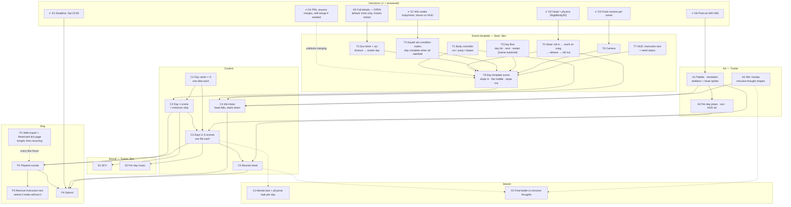

# Task dependencies

What has to exist before what. The task list is [TASKS.md](TASKS.md) (same IDs); this is the *order* view. Built from [DESIGN.md](DESIGN.md) §2 after Friday's meeting — if a node here isn't in the Google Doc, add it there or delete it here. GitHub renders the chart; in VS Code you need a Mermaid preview extension, or read the text version below.

**Critical path:** *head roll/stuck/release (T2) → day template (T8) → day 1 (C2) → days 2–5 (C3) → reunion (C5) → submit (P4).* Art and sound run beside it and gate the *look*, not the *code*. Decisions D1–D4, D6, D7 are answered (✔); only **D5 fail details** is open, with a stated default.

## Unblocked right now (no arrows in, or only from the template that already exists)

- **D5** fail details is the only open decision — and it has a default, so nothing waits on it.
- **T1** body controller, **T2** physics head, **T3** sun timer, **T4** win nodes, **T5** day flow, **T6** camera, **T7** HUD — all buildable tonight with rectangles, independent of each other; they meet in **T8**.
- **C1** day cards — anyone, any time; the earlier they exist the earlier days 2–5 can start.
- **A0/A1** art direction + sprites (pixel 640×360 confirmed); **A2** kiki/bouba shapes any time after.
- **P1** — make the Restricted itch page tonight and upload the template's `web.zip` to prove the pipeline.

## Text version (same graph)

| Task | Needs first |
|---|---|
| T2 head roll/stuck/release | D2 |
| T3 sun timer | D5 |
| T4 keyed win nodes | D7 |
| T6 camera | D3 |
| T8 day template | T1–T7 |
| C2 day 1 | T8, C1 |
| C3 days 2–5 | C2, C1, A3 (for final look) |
| C4 intro beat | T1, T2, A1, A2 |
| C5 reunion beat | C3 (at least the last day), A1 |
| A1 palette/sprites | D6 |
| A3 per-day art | A1 |
| S1 SFX | C2 (a scene to put it in) |
| S2 per-day music | C3 |
| P2 playtests | C2, then C3; a fresh P1 each round |
| P3 remove text | P2 |
| P4 submit | D1, P2, C4, C5 |
| X1, X2 stretch | C3 / C5 + A2 |
