# Task dependencies

What has to exist before what. The task list is [TASKS.md](TASKS.md) (same IDs — except D1–D7, Q1, K1, S0 and TR, the Friday decisions / smoke suite / dev keys / audio scaffold / transition base, which have no TASKS.md row and are tracked only here); this is the *order* view. `E*` rows (setup, hard stop, stand-up, scope check, freeze) are clock events and live only in TASKS.md; `P1r`/`P2·0` are repeats of P1/P2. Built from [DESIGN.md](DESIGN.md) §2. GitHub renders the chart; in VS Code you need a Mermaid preview extension, or read the text version below.

**Reassessed Sat 22 Aug 08:00 against branch `night/all`** (what the code actually is: [CODEBASE.md](CODEBASE.md)). ✔ = evidence in the repo · ◐ = partial · no mark = not started. Rows `D13–D16` and `N1–N8` are new since Friday — candidates for the stand-up, not decisions.

**Critical path now:** *merge the night's branches to `main` (N3) → decide D8 cut order + D13 flow system (E3) → days 2–3 (C3) on the web (P1r) → end card (N1, or a text card) → playtest (P2) → submit (P4).* Template, day flow, a playable day 1, the smoke suite, the audio scaffold and the transition are **done**; art and sound files run beside the path and gate the *look/sound*, not the *code*. Open decisions: **D5** fail presentation (two exist), **D8** cut order, **D11** R/Esc/after-end-card, **D12** jump arc vs step 1, **D13** one flow system or two, **D14** does `day_template` ship as day 1, **D15** panic day body need, **D16** head blocks the path in platforming_day.

```mermaid
flowchart TD
  subgraph D["Decisions (✔ = answered)"]
    D1["✔ D1 Deadline: Sat 23:59"]
    D2["✔ D2 Head = scripted"]
    D3["✔ D3 Fixed camera"]
    D4["✔ D4 PRs: anyone merges"]
    D6["✔ D6 Pixel art 640×360"]
    D7["✔ D7 Win nodes body/mind"]
    D5["D5 Fail presentation — OPEN<br/>instant reload vs game-over card (both exist)"]
    D8["D8 Cut order — OPEN<br/>proposal rewritten in TASKS.md"]
    D11["D11 R / Esc / after end card — OPEN"]
    D12["D12 Jump arc vs step 1 — OPEN"]
    D13["D13 One day-flow system or two — OPEN<br/>(WinConditions+Events vs DayManager)"]
    D14["D14 day_template ships as day 1? — OPEN"]
    D15["D15 Panic day: add a body need? — OPEN"]
    D16["D16 Head blocks the path (platforming) — intended?"]
  end

  subgraph T["Scene template — done"]
    T0["✔ T0 API contract"]
    T1["✔ T1 Body controller"]
    T2["✔ T2 Head: stuck → release → off"]
    T3["✔ T3 Sun timer → sunset fails"]
    T4["✔ T4 Keyed win nodes (+ two managers)"]
    T5["✔ T5 Day flow (Game.DAY_SCENES)"]
    T6["✔ T6 Fixed camera"]
    T7["◐ T7 HUD: instruction ✔ · win-lights ✗"]
    T8["◐ T8 Day template ✔ + HOWTO ✔ · HUD lights ✗"]
    Q1["✔ Q1 Smoke suite (tools/smoke_test.sh)<br/>bot plays intro → end"]
    K1["✔ K1 Dev keys F1–F10 + overlay"]
  end

  subgraph C["Content"]
    C1["◐ C1 Day cards — 1 of ~5"]
    C2["✔ C2 Day 1 (Bridge card) = platforming_day<br/>runs LAST in DAY_SCENES today (D13/D14)"]
    C3["◐ C3 Days 2–3 (day_panic ✔ mind-only) then 4–5"]
    TR["✔ TR Transition base + cage fork<br/>◐ one fork per remaining day"]
    C4["◐ C4 Intro: chase ✔ · pop-off beat ✗"]
    C5["◐ C5 Reunion: dive ✔ · end card ✗"]
    N1["N1 End card after the reunion<br/>(today: main.tscn placeholder)"]
  end

  subgraph A["Art — Tucker"]
    A0["◐ A0 Art direction (palette ✔, style sheet ✗)"]
    A1["✔ A1 Skeleton + head sprites, wired"]
    A2["A2 Kiki / bouba shapes"]
    A3["◐ A3 Props: bridge/steps/cage/sun ✔ · goals/floors/HUD ✗"]
  end

  subgraph S["Sound — Tucker, Ben"]
    S0["✔ S0 Sfx + Music scaffold (night/sfx)<br/>16 cues, tracks by scene"]
    S1["◐ S1 SFX files (0/16) + 3 one-line hooks"]
    S2["◐ S2 Music files (0/5)"]
  end

  subgraph P["Ship"]
    N3["N3 Merge PR #16 + night/* to main, re-export"]
    J1["J1 Jam admin: rules · TZ · Doc link"]
    P1["P1 itch page + web.zip — export ✔ · upload ?"]
    P2["P2 Playtests (17:00 mini, 19:00 full)"]
    P5["P5 Keep/drop instruction text per day"]
    P3["◐ P3 Itch page (credits ✔ · rest ✗)"]
    P4["P4 Submit"]
  end

  subgraph H["Housekeeping (N2, N4, N5, N8 — N6 lives under TR, N7 under S1)"]
    N2["N2 day_01.tscn: delete or restore"]
    N4["N4 Dead code: Events.sunset · intro next_scene · panic_label comment"]
    N5["N5 Multi-machine Godot paths (GODOT=…, 4.7.2)"]
    N8["N8 sky_drift on platforming_day?"]
  end

  subgraph X["Stretch"]
    X1["X1 Mental + physical task per day"]
    X2["X2 Final battle vs intrusive thoughts"]
    X3["X3 Intrusive thoughts mid-day"]
    X4["X4 Title / press-any-key screen"]
  end

  D8 --> C3
  D13 --> C3
  D14 --> C3
  D15 --> C3
  D16 --> C2
  D12 --> C2
  D11 --> N1
  D5 --> P2

  T8 --> C2
  T8 --> C3
  C2 -. worked example .-> C3
  C1 --> C3
  K1 -. speeds up .-> C3
  Q1 -. proves .-> C3
  TR --> C3
  C3 --> TR

  T1 --> C4
  T2 --> C4
  A2 --> C4
  C3 --> C5
  C5 --> N1
  N1 --> P4

  A0 --> A2
  A1 --> A3
  C3 --> A3
  T7 --> A3

  S0 --> S1
  S0 --> S2
  C3 --> S2

  N3 --> P1
  P1 -. after every merged day .-> P2
  Q1 --> P2
  C2 --> P2
  C3 --> P2
  P2 --> P5
  A3 --> P3
  J1 --> P3
  P2 --> P4
  P3 --> P4
  J1 --> P4
  D1 --> P4
  N2 -.-> N3
  N4 -.-> P3

  C3 -.-> X1
  C5 -.-> X2
  A2 -.-> X2
  A2 -.-> X3
  N1 -.-> X4
```

## Unblocked right now (Sat 08:00)

- **N3 — merge.** `origin/main` is 30 commits behind `night/all`; PR #16 is open. Nothing else lands on the itch build until this does. Then `tools/smoke_test.sh --web` and upload (P1r).
- **E3 / decisions.** D8, D13, D14, D15, D16 need five minutes each; the agenda with options is [overnight-2026-08-22.md §4](overnight-2026-08-22.md). D5/D11/D12 have defaults or proposals.
- **C1 — day cards.** Only the Bridge card exists; day_panic and the transition were built without one. Write panic's + ~3 more in the §3.7 format.
- **C3 — days 2–3.** One owner each; copy `day_template.tscn` per [days/HOWTO.md](days/HOWTO.md); one line in `Game.DAY_SCENES`; F7 to jump to it; a 3-line bot plan when stable.
- **N1 — end card.** Decide the look (DESIGN §3.6) and point `reunion.gd`'s `next_scene` at it; the run ends on the placeholder today.
- **S1/S2 — record.** Wiring is done except four one-line calls (`cage`, `thud` in the transition, `bridge_drop` in `_drop_bridge()`, optional `step` — N7); files are the work. [assets/audio/README.md](../assets/audio/README.md) is the list; `day.ogg` first.
- **A2 — kiki/bouba** unblocks the intro pop-off (C4) and X2/X3.
- **J1, P3, P4 owners** are still `?`.

## Text version (same graph)

| Task | Needs first | State |
|---|---|---|
| T0–T6, T8 template, Q1 smoke suite, K1 dev keys, S0 audio scaffold, TR transition base, C2 day 1, A1 sprites | — | **done** (on `night/all`; merge = N3) |
| T7 HUD lights | T4 ✔ | instruction text ✔ per day; lights not started |
| C1 day cards | — | 1 of ~5 |
| C3 days 2–3, then 4–5 | T8 ✔, C1, D8, D13 (or keep "pick one system per day"); 4–5 only after 2–3 run on the web | day_panic ✔ (mind-only → D15) |
| TR forks (one per remaining day) | TR ✔, the day it leads into | cage fork ✔ |
| C4 intro pop-off beat | A2 (shapes) — or a text card (D8) | chase ✔ |
| C5 reunion | done; end card = N1 | dive ✔ |
| N1 end card | D11 (what R does after), DESIGN §3.6 | not started — `main.tscn` placeholder |
| A2 kiki/bouba | A0 ◐ (the palette is enough to start) | not started |
| A3 per-day art | A1 ✔, C3, T7 | bridge/steps/cage/sun ✔ |
| S1 SFX files | S0 ✔ (+ 3 one-line hooks: cage, thud, bridge_drop) | 0/16 |
| S2 music files | S0 ✔, E4 | 0/5 |
| J1 jam admin | — | not started |
| N3 merge + re-export | Tucker's review (done Sat 07:xx) | PR #16 + night/* open |
| P1 itch page | N3; then after every merged day | export ✔, upload unconfirmed |
| P2 playtests | P1, Q1 green, C2/C3 | seed list: end card, R/Esc, Firefox/Safari |
| P5 text per day | P2 (17:00) | — |
| P3 itch page | A3, J1 | credits + embed settings ✔ |
| P4 submit | P2, P3, J1, D1; N1 or its text card | — |
| N2 day_01, N4 dead code, N5 machine paths, N8 sky_drift on platforming | — | small — N2 Sean, N4 anyone, N5 Sean/Ben, N8 Sean |
| X1–X4 stretch | C3 / C5 + A2 / A2 + C3 / N1 | — |
